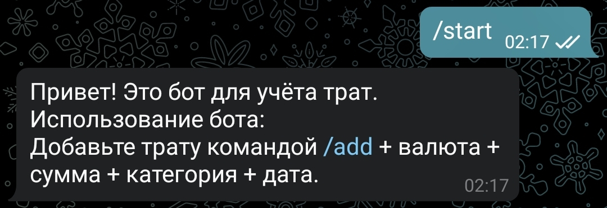
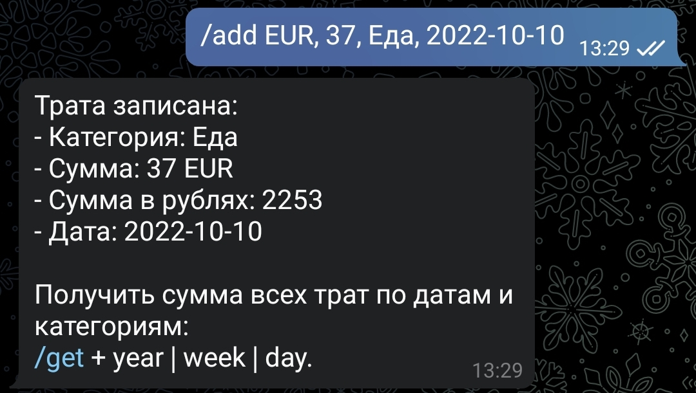
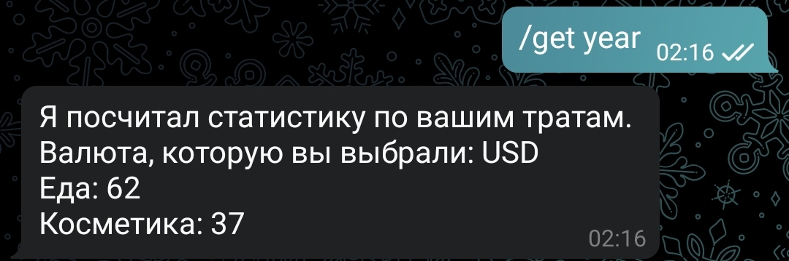
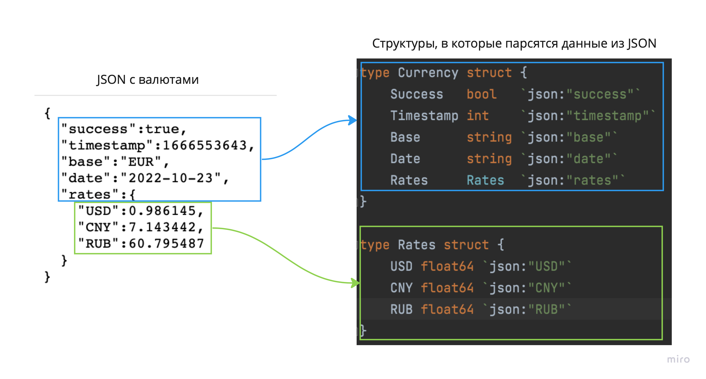

## Структура проекта

```plain
├── cmd/
│   └── bot/
│       └── main.go					# Входная точка в проект
│
├── internal/
│   ├── clients/             #
│   ├── config/              # Обработка конфиг-файла
│   ├── mocks/     			 # Файл из шаблона, подключающий фреймворк Gomock для тестирования, но в этом проекте тестов нет.
│   ├── model/  
│ 	│ 	└── messages/
│ 	│		└── incoming_msg.go    #     
│ 	│		└── expenses.go 		
│	│		└── report.go
│   │
│   └── storage          			#package, в котором хранятся данные по тратам
│       └── user.go		
│ 
```

## Как пользоваться ботом

Бот доступен по логину в телеграме: @Ozon_theo_bot.

#### Методы

| Команда  | Примеры  | Описание |
|------------- |---------------| -------------|
| `/start`      | — | Подсказка и приветствие, начало работы с ботом. \n  |
| `/add`      | `/add EUR, 50, Еда, 2022-10-10` | \n Добавление основной валюты и траты. Строгий формат: `/add ВАЛЮТА(USD, CNY, EUR, RUB), СУММА, КАТЕГОРИЯ, ДАТА-В-ФОРМАТЕ-2022-10-10` \n  |
| `/get` | `/get year` | Получение статистики по тратам за год, месяц, неделю. Формат: `/get СРОК(year, month, week)` </br>  |

--------
## Откуда берём валюты

Бот работает с 4 валютами: USD, CNY, EUR, RUB.

API для получения валют онлайн: `http://api.exchangeratesapi.io/v1/latest?access_key=9c484230306ca3014e2eb4c8575de8df&symbols=USD,CNY,RUB&format=1`

Всё, что с этим связано, лежит в `model/messages/expenses`. Примечание к иллюстрации: в структуре есть в EUR, он равен единице.


### Как высчитывается валюта
**Base** — базовая валюта, от которой высчитываются значения остальных. В апи, который я использую, это EUR.

Например, мы знаем, что: 
1 USD = 0.87 EUR, 
1 USD = 0.73 GBP, 
Чтобы узнать, сколько EUR равняется GBP, используется формула:

```
a / b = c
```

```
EURGBP = (USDGBP / USDEUR) = (0.73 / 0.87) = 0.84
```

-------

## Описание заданий
### Домашняя работа 1
Нужно добавить функционал:
- Команда добавления новой финансовой "траты". В трате должна присутствовать сумма, категория и дата. Но можете добавить еще поля, если считаете нужным. Придумайте, как оформить команду так, чтобы пользователю было удобно ее использовать.
- Хранение трат в памяти, базы данных пока не используем.
- Команда запроса отчета за последнюю неделю/месяц/год. В отчете должны быть суммы трат по категориям.

### Домашняя работа 2
- Команда переключения бота на конкретную валюту - "выбрать валюту"
- После ввода команды бот предлагает выбрать интересующую валюту из четырех: USD, CNY, EUR, RUB
- При нажатии на нужную валюту переключаем бота на нее - результат получение трат конвертируется в выбранную валюту.
- Храним траты всегда в рублях, конвертацию используем только для отображения, ввода и отчетов
                     
Особенности:
- При запуске сервиса мы в отдельном потоке запрашиваем курсы валют.
- Запрос курса валют происходит из любого из открытых источников.
- Сервис должен завершаться gracefully.
